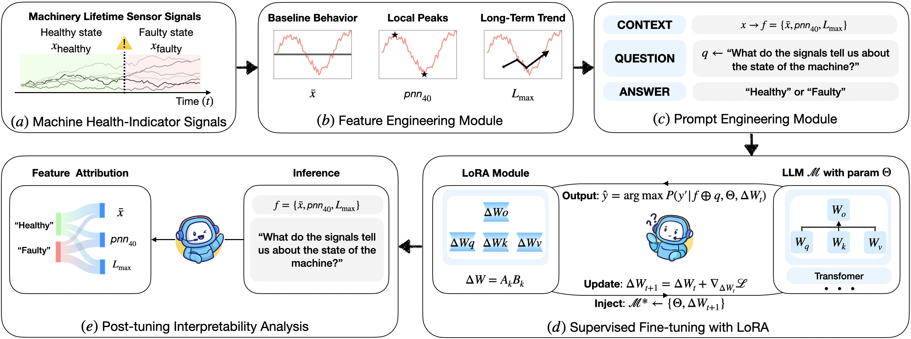

# rcf-llm-framework-demo
This repository provides a demo implementation of the framework proposed in the paper “Condition Monitoring Framework Using Reliability-Centered Features and Large Language Models”. The goal is to make our method accessible to researchers and practitioners through an interactive Jupyter notebook.

## Repository Structure

- **`the-framework-notebook.ipynb`**  
  Main Jupyter notebook that walks through the proposed framework. This includes data preparation, fine-tuning, and evaluation.  

- **`gene_finetune_data.py`**  
  Python helper functions to generate fine-tuning prompts from reliability-centered features.  

- **`7_LT_60_SL.jsonl`**  
  Processed input dataset containing SMART signals that have been cleaned and transformed into reliability-centered features.  
  > For more details on the signal processing process, you can also check:  
  > Wei Li, et al. *"Explainable time series features for hard disk drive failure prediction."*  
  > *Engineering Applications of Artificial Intelligence*, 152 (2025): 110674.  
  > [https://doi.org/10.1016/j.engappai.2025.110674](https://doi.org/10.1016/j.engappai.2025.110674)  

---

## Getting Started

### 1. Setup
Download all files (`the-framework-notebook.ipynb`, `gene_finetune_data.py`, `7_LT_60_SL.jsonl`) into the **same directory** in your Google Drive.  

### 2. Open Notebook
- Open **Google Colab** or a local Jupyter environment.  
- Load `the-framework-notebook.ipynb`.  
- Modify the **path information** in the notebook to match the location of your files.  

### 3. Run
Execute each cell in the notebook following the provided instructions.  

---

## Notes
- This repository is primarily for **demonstration purposes**.  
- The included dataset (`7_LT_60_SL.jsonl`) is a **processed version** of SMART signals data, pre-cleaned and converted into reliability-centered features.  
- The main contribution highlighted is the **Supervised Fine-tuning with LoRA** workflow.
